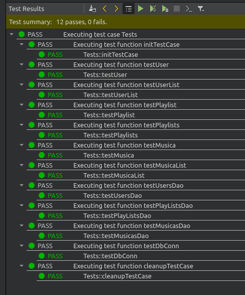

# JPotify
POC de cliente básico em Qt para testar API do SPotfi.

#### Recursos
Guardar diferentes ClientId's;
Criar playlists e guardar localmente;
Adicionar músicas a uma playlist;
Tocar samplers da lista.
```
Build in Qt 5.15.2 , SO Linux.
```

#### Testes

https://github.com/jailsonlinux/jpotify/tree/master/blob/tests1.png


